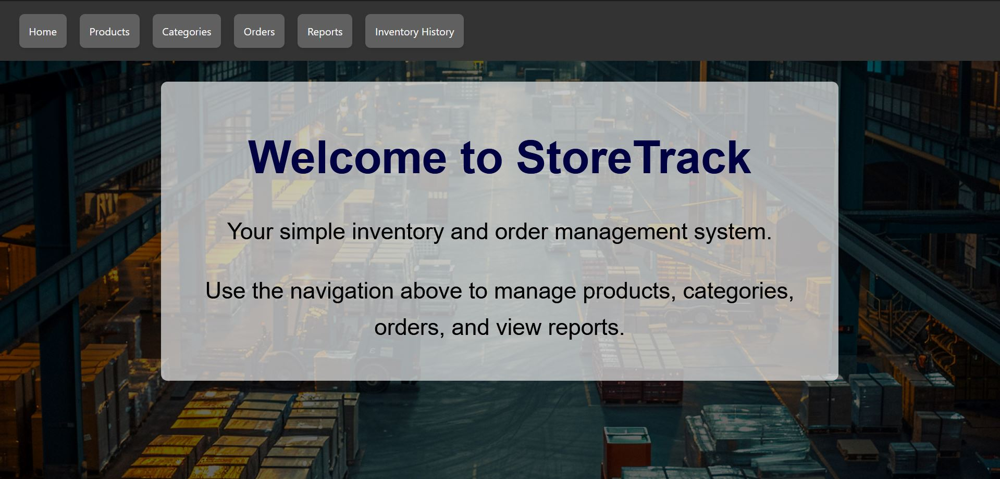
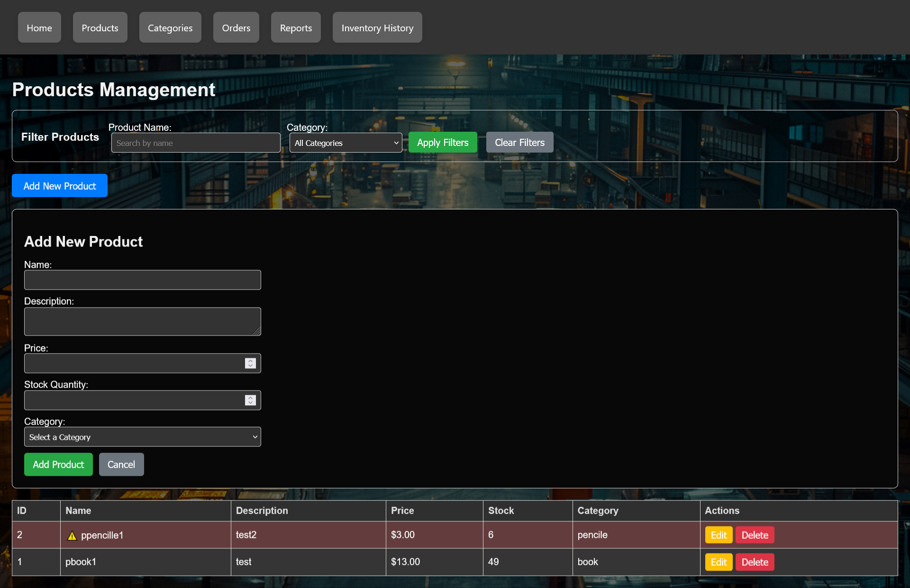
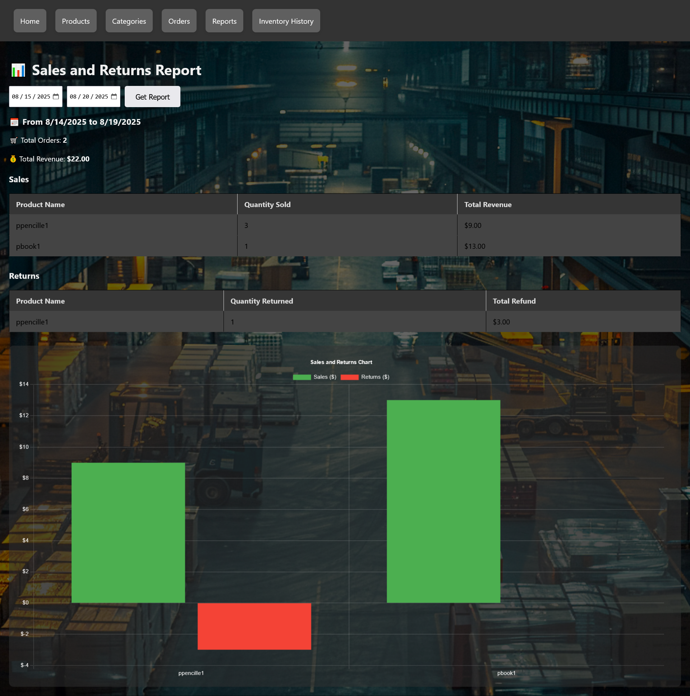
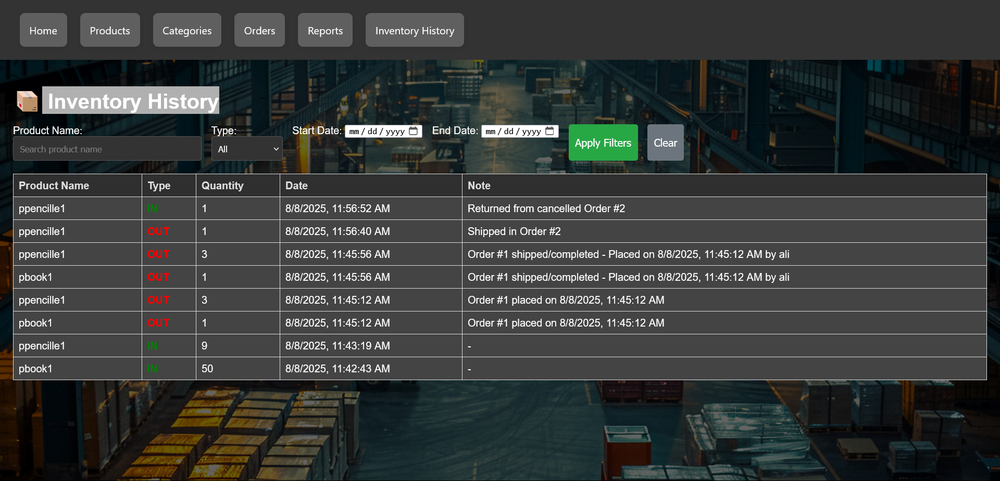
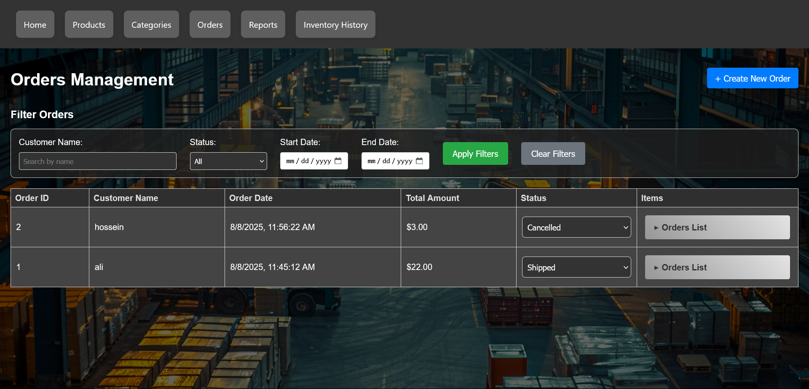

# Inventory and Product Management Project (StoreTrack)


**StoreTrack** is a full-stack web application for managing product inventory in a store or warehouse. This project allows users to add, edit, delete, and view products. The application is developed using **React** for the frontend, **Node.js (Express)** for the backend, and **PostgreSQL** as the database.

---

## 🌟 Key Features

-   **Full CRUD for Products:** Create, read, update, and delete products.
-   **Responsive User Interface:** Modern design that is usable on various devices.
-   **Powerful API:** A RESTful backend to manage all business logic.
-   **Relational Database:** Utilizes PostgreSQL for stable and reliable data storage.
-   **Search and Filter:** Ability to quickly search for products by name or other attributes. _(If this feature exists)_

---

## 🛠️ Technologies Used

| Component         | Technology                                  |
|-------------------|---------------------------------------------|
| **Frontend**      | React, Axios, CSS/SASS                      |
| **Backend**       | Node.js, Express.js                         |
| **Database**      | PostgreSQL                                  |
| **Package Manager**| npm                                         |

---

## 📸 Project Gallery

Here are a few views from different parts of the application:

| Main Products Page                                | Reporting Page                                      |
| -------------------------------------------------- | ---------------------------------------------------- |
|      |     |
|                                                    |                                                      |

| Order Page                                        | Goods Entry/Exit History                             |
| -------------------------------------------------- | ---------------------------------------------------- |
|      |      |

---

## ⚙️ Prerequisites

Before you begin, ensure you have the following software installed on your system:

-   [**Node.js**](https://nodejs.org/) (Version 18 or higher is recommended)
-   [**npm**](https://www.npmjs.com/get-npm) (Usually installed with Node.js)
-   [**PostgreSQL**](https://www.postgresql.org/download/) (An active database server)

---

## 🚀 Installation and Setup Guide

To run the project on your local machine, follow these steps:

### 1. Clone the project from GitHub
```bash
git clone https://github.com/your-username/your-repository-name.gitcd your-repository-name
```

### 2. Set up the Backend

First, navigate to the `backend` folder and install the dependencies.

```bash
cd backend
npm install
```

#### Set up Environment Variables

Create a `.env` file in the root of the `backend` folder and enter your PostgreSQL database connection information.

**`backend/.env`**
```env
# Database connection info
DB_USER=postgres
DB_PASSWORD=your_postgres_password
DB_HOST=localhost
DB_PORT=5432
DB_DATABASE=storetrack

# Port the server runs on
PORT=3001
```

**Important Note:** Make sure to create a database named `storetrack` (or your preferred name) in PostgreSQL.

#### Run the Backend Server
```
bashnpm start
```
Your backend server is now running at `http://localhost:3001`.

### 3. Set up the Frontend

In a new terminal, navigate to the `frontend` folder and install the dependencies.```bash
cd frontend
npm install
```

#### Set the API Address

The frontend needs to know the address of the backend API. To do this, create a `.env` file in the root of the `frontend` folder.

**`frontend/.env`**
```env
REACT_APP_API_URL=http://localhost:3001```

#### Run the Frontend Application
```bash
npm start
```
After running this command, the application will automatically open in your browser at `http://localhost:3000`.

---

## API Endpoints

The backend of this project includes the following endpoints for managing products:

| Method   | Route                 | Description                        |
|----------|-----------------------|------------------------------------|
| `GET`    | `/api/products`       | Get a list of all products         |
| `GET`    | `/api/products/:id`   | Get a specific product by its ID   |
| `POST`   | `/api/products`       | Add a new product                  |
| `PUT`    | `/api/products/:id`   | Update an existing product         |
| `DELETE` | `/api/products/:id`   | Delete a product                   |

**Example `POST` Request Body (Input for adding a product):**
```json
{
  "name": "Laptop Model X",
  "price": 25000000,
  "quantity": 15,
  "description": "A powerful laptop with a Core i7 processor"
}
```

### General Product Object Structure
A product object in the API responses will look like this:
```json
{
  "id": 1,
  "name": "Laptop Model X",
  "price": 25000000,
  "quantity": 15,
  "description": "A powerful laptop with a Core i7 processor",
  "created_at": "2025-08-14T10:00:00.000Z",
  "updated_at": "2025-08-14T10:00:00.000Z"
}
```

### General Error Response Structure
In case of an error, the response will include a specific message:
```json
{
  "error": "The error message will be placed here"
}
```
---

### 1. Get a list of all products

-   **Endpoint:** `GET /api/products`
-   **Description:** Returns a list of all products available in the database.
-   **Query Parameters (Optional):**
    -   `search` (string): You can use this parameter to search by product name. Example: `/api/products?search=laptop`
-   **Success Response (200 OK):**
    -   Returns an array of product objects. If no products exist, the array will be empty.
    ```json
    [
      {
        "id": 1,
        "name": "Laptop Model X",
        "price": 25000000,
        "quantity": 15,
        "description": "A powerful laptop with a Core i7 processor"
      },
      {
        "id": 2,
        "name": "Wireless Mouse",
        "price": 500000,
        "quantity": 40,
        "description": "Optical mouse with Bluetooth connectivity"
      }
    ]
    ```

---

### 2. Get a specific product

-   **Endpoint:** `GET /api/products/:id`
-   **Description:** Returns the information for a specific product using its ID.
-   **URL Parameters:**
    -   `id` (number): The unique identifier of the product.
-   **Success Response (200 OK):**
    -   Returns a single product object.
    ```json
    {
      "id": 1,      "name": "Laptop Model X",
      "price": 25000000,
      "quantity": 15,
      "description": "A powerful laptop with a Core i7 processor"
    }
    ```
-   **Error Response (404 Not Found):**
    -   If a product with the specified ID is not found.
    ```json
    {
      "error": "Product with ID 1 not found"
    }
    ```

---

### 3. Add a new product-   **Endpoint:** `POST /api/products`
-   **Description:** Adds a new product to the database.
-   **Request Body:**
    -   Must be a JSON object with the following fields. `name`, `price`, and `quantity` are required.
    ```json
    {
      "name": "RGB Mechanical Keyboard",      "price": 1200000,
      "quantity": 25,
      "description": "Keyboard with customizable lighting and blue switches"
    }
    ```
-   **Success Response (201 Created):**
    -   Returns the newly created product object (including its assigned `id`).
    ```json
    {
      "id": 3,
      "name": "RGB Mechanical Keyboard",      "price": 1200000,
      "quantity": 25,
      "description": "Keyboard with customizable lighting and blue switches",
      "created_at": "2025-08-14T11:30:00.000Z",
      "updated_at": "2025-08-14T11:30:00.000Z"
    }
    ```
-   **Error Response (400 Bad Request):**
    -   If required fields are not sent or data types are incorrect.
    ```json
    {      "error": "The name field is required"
    }
    ```

---

### 4. Update an existing product

-   **Endpoint:** `PUT /api/products/:id`
-   **Description:** Updates the information of an existing product.
-   **URL Parameters:**
    -   `id` (number): The ID of the product to be edited.
-   **Request Body:**
    -   A JSON object containing the fields you intend to change.
    ```json
    {
      "price": 24500000,      "quantity": 12
    }
    ```
-   **Success Response (200 OK):**
    -   Returns the complete product object after the update.
    ```json
    {
      "id": 1,
      "name": "Laptop Model X",
      "price": 24500000,
      "quantity": 12,
      "description": "A powerful laptop with a Core i7 processor",
      "updated_at": "2025-08-14T12:00:00.000Z"
    }
    ```-   **Error Response (404 Not Found):**
    -   If no product is found to update.

---

### 5. Delete a product

-   **Endpoint:** `DELETE /api/products/:id`
-   **Description:** Deletes a product from the database.
-   **URL Parameters:**
    -   `id` (number): The ID of the product to be deleted.
-   **Success Response (200 OK):**
    -   Returns a confirmation message.
    ```json
    {
      "message": "Product with ID 1 was successfully deleted"
    }
    ```
-   **Error Response (404 Not Found):**
    -   If no product is found to delete.
    ```json
    {
      "error": "Product with ID 1 not found"
    }
    ```
